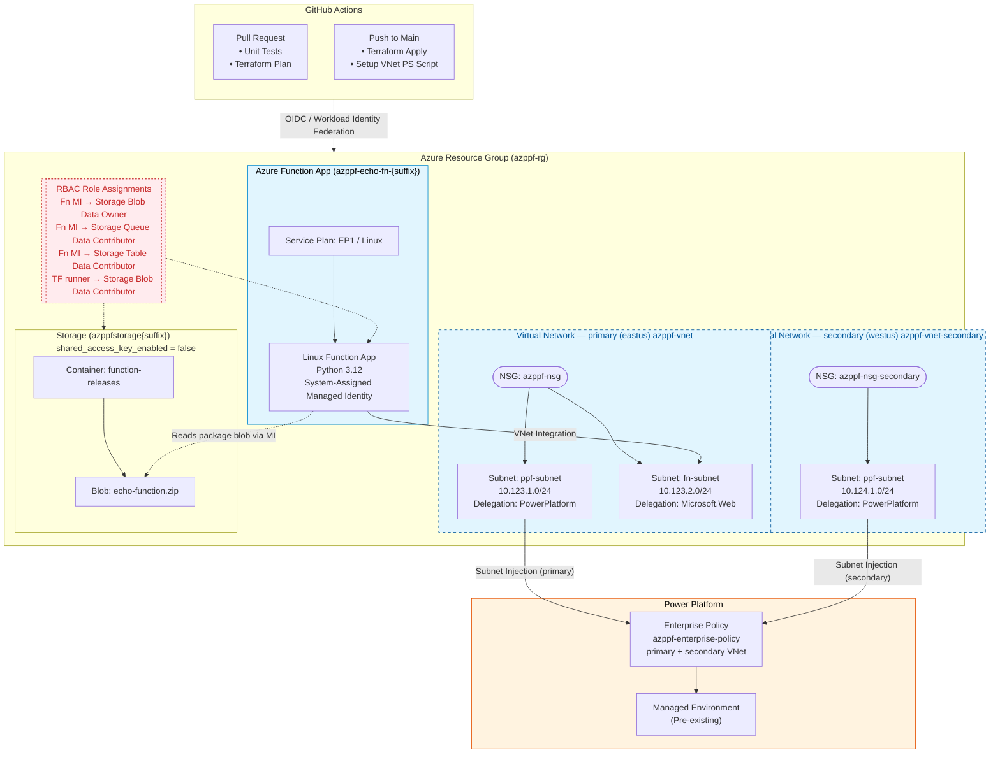

## GitHub Actions for Azure and Power Platform VNet Integration Using Terraform

This is a sample repository that shows how to use **GitHub Actions workflows (CI/CD)** to manage **Azure** infrastructure and **Power Platform Virtual Network support** with **Terraform**. 

> [!NOTE]
> - Power Platform and the Azure subscription must be in the same Microsoft Entra tenant.  
> - The single VNet scenario is only supported in regions listed under the [Supported regions](https://learn.microsoft.com/en-us/power-platform/admin/vnet-support-overview#supported-regions) documentation.  
> - In most cases, you will need to deploy multiple VNets.

- [Terraform Azure Provider](https://registry.terraform.io/providers/hashicorp/azurerm/latest/docs)
- [Azure Function App Documentation](https://learn.microsoft.com/en-us/azure/azure-functions/)
- [Set up virtual network support for Power Platform](https://learn.microsoft.com/en-us/power-platform/admin/vnet-support-setup-configure)
- [GitHub Actions Documentation](https://docs.github.com/en/actions)



### 1. Create `variables.secret.tfvars`

This file is gitignored and must be created manually. It holds secrets and deployment-mode flags.

```hcl
# variables.secret.tfvars

# Azure identity — see "How to find AZURE_CLIENT_ID" below
tenant_id       = "<your-azure-tenant-id>"
subscription_id = "<your-azure-subscription-id>"

primary_location   = "eastus"
secondary_location = "westus"

# Two region geography - US geography (unitedstates) requires a primary (eastus) + secondary (westus) VNet pair.
# Set to true before running setup-powerplatform-vnet.ps1.
enable_secondary_vnet = true

# Single region geography - Set to false to skip the secondary VNet
# enable_secondary_vnet = false
```

### 2. How to find required IDs

**`subscription_id` / `AZURE_SUBSCRIPTION_ID`**
```bash
az account show --query "{subscriptionId:id, tenantId:tenantId}"
```

**`tenant_id` / `AZURE_TENANT_ID`**  
Same command as above, or: [Azure Portal → Microsoft Entra ID → Overview → Tenant ID](https://portal.azure.com/#view/Microsoft_AAD_IAM/ActiveDirectoryMenuBlade/~/Overview)

**`AZURE_CLIENT_ID`** (app registration for GitHub Actions OIDC)  
```bash
# Create the app registration
az ad app create --display-name "github-actions-terraform"
# The output contains "appId" — that is your AZURE_CLIENT_ID

# Create a service principal for it
az ad sp create --id <appId>

# Grant Contributor on the subscription
az role assignment create \
  --assignee <appId> \
  --role Contributor \
  --scope /subscriptions/<subscriptionId>
```

Then add a federated credential so GitHub Actions can authenticate without a secret:
```bash
az ad app federated-credential create \
  --id <APP_OBJECT_ID> \
  --parameters '{
    "name": "github-actions-main",
    "issuer": "https://token.actions.githubusercontent.com",
    "subject": "repo:<org>/<repo>:ref:refs/heads/main",
    "audiences": ["api://AzureADTokenExchange"]
  }'

# Also add one for pull requests (enables the plan job on PRs)
az ad app federated-credential create \
  --id <APP_OBJECT_ID> \
  --parameters '{
    "name": "github-actions-pr",
    "issuer": "https://token.actions.githubusercontent.com",
    "subject": "repo:<org>/<repo>:pull_request",
    "audiences": ["api://AzureADTokenExchange"]
  }'
```

**`POWERPLATFORM_ENVIRONMENT_ID`**  
Power Platform admin center → **Environments** → select your environment → **Settings** → **Details** → copy the **Environment ID** (GUID).  
The environment must be a **Managed Environment** for VNet integration to work.

### 3. GitHub Secrets and Variables to configure

Go to **Settings → Secrets and variables → Actions** in your repository and add:

**Secrets** (sensitive values):

| Secret | Where to get it |
|---|---|
| `AZURE_CLIENT_ID` | `appId` from app registration (step 2) |
| `AZURE_SUBSCRIPTION_ID` | `az account show` |
| `AZURE_TENANT_ID` | `az account show` |
| `POWERPLATFORM_ENVIRONMENT_ID` | Power Platform admin center — **Environments → Settings → Details → Environment ID** (GUID only, no `Default-` prefix) |

**Variables** (non-sensitive configuration):

| Variable | Example value | Notes |
|---|---|---|
| `PRIMARY_LOCATION` | `japaneast` | Azure region for the resource group and all primary resources |
| `SECONDARY_LOCATION` | `japanwest` | Azure region for the secondary VNet |
| `ENABLE_SECONDARY_VNET` | `true` | Deploy secondary VNet. Set `true` for multi-region Power Platform geography (e.g. US, Japan). Set `false` for single-region. |
| `ENTERPRISE_POLICY_LOCATION` | `japan` | Power Platform geography — **not** an Azure region name. Find it in Power Platform admin center → **Environments → Settings → Details → Region**. See [supported geographies](https://learn.microsoft.com/en-us/power-platform/admin/vnet-support-overview#supported-regions) |

### 4. Run locally

```bash
# Creates an execution plan
terraform plan -out=tfplan

# Applies the saved execution plan
terraform apply "tfplan"
# or (apply without a saved plan and skip approval)
terraform apply -auto-approve

# Destroys all managed resources
terraform destroy
```

After apply, run the Power Platform VNet setup:

```powershell
.\powershellscripts\setup-powerplatform-vnet.ps1 `
    -EnvironmentId  "<guid-from-ppac-settings>" `
    -TenantId       "<your-azure-tenant-id>" `
    -SubscriptionId "<your-azure-subscription-id>" `
    -PolicyLocation "<power-platform-geography>"
```

To decommission VNet integration and destroy all infrastructure:

```powershell
# Step 1 — unlink the enterprise policy from Power Platform and delete it.
# Must be done BEFORE terraform destroy so the subnets are released first.
.\powershellscripts\teardown-powerplatform-vnet.ps1 `
    -EnvironmentId  "<guid-from-ppac-settings>" `
    -TenantId       "<your-azure-tenant-id>" `
    -SubscriptionId "<your-azure-subscription-id>"

# Step 2 — destroy all Terraform-managed Azure resources.
terraform destroy
```

### 5. Call Azure Function

The Azure Function App API can be called using the following URL:

```
https://your-function-app-endpoint.azurewebsites.net/api/echo
```

To test the connection between Azure and Power Platform, use a Power Apps Canvas App located in the `powerapps` directory.

1. Navigate to: [https://make.powerapps.com](https://make.powerapps.com)
2. Import the `HelloAzureSolution.zip` solution file in `powerapps` directory
3. Update the `AzureFunctionBaseUrl` environment variable in the solution with your Azure Function App URL.
4. Open the Power App.
5. Click the **Echo** button to call the API hosted in the Azure Function App. The response from the API will be displayed in the purple area.


---

> [!IMPORTANT]  
> The following descriptions originate from [Azure-Samples/terraform-github-actions](https://github.com/Azure-Samples/terraform-github-actions)

<details>
<summary>Expand</summary>

# Azure-Samples/terraform-github-actions

## Architecture


## Dataflow

1. Create a new branch and check in the needed Terraform code modifications.
2. Create a Pull Request (PR) in GitHub once you're ready to merge your changes into your environment.
3. A GitHub Actions workflow will trigger to ensure your code is well formatted, internally consistent, and produces secure infrastructure. In addition, a Terraform plan will run to generate a preview of the changes that will happen in your Azure environment.
4. Once appropriately reviewed, the PR can be merged into your main branch.
5. Another GitHub Actions workflow will trigger from the main branch and execute the changes using Terraform.
6. A regularly scheduled GitHub Action workflow should also run to look for any configuration drift in your environment and create a new issue if changes are detected.

## Workflows

1. [**Terraform Unit Tests**](.github/workflows/tf-unit-tests.yml)

    This workflow runs on every commit and is composed of a set of unit tests on the infrastructure code. It runs [terraform fmt]( https://www.terraform.io/cli/commands/fmt) to ensure the code is properly linted and follows terraform best practices. Next it performs [terraform validate](https://www.terraform.io/cli/commands/validate) to check that the code is syntactically correct and internally consistent. Lastly, [checkov](https://github.com/bridgecrewio/checkov), an open source static code analysis tool for IaC, will run to detect security and compliance issues. If the repository is utilizing GitHub Advanced Security (GHAS), the results will be uploaded to GitHub.

2. [**Terraform Plan / Apply**](.github/workflows/tf-plan-apply.yml)

    This workflow runs on every pull request and on each commit to the main branch. The plan stage of the workflow is used to understand the impact of the IaC changes on the Azure environment by running [terraform plan](https://www.terraform.io/cli/commands/plan). This report is then attached to the PR for easy review. The apply stage runs after the plan when the workflow is triggered by a push to the main branch. This stage will take the plan document and [apply](https://www.terraform.io/cli/commands/apply) the changes after a manual review has signed off if there are any pending changes to the environment.

3. [**Terraform Drift Detection**](.github/workflows/tf-drift.yml)

    This workflow runs on a periodic basis to scan your environment for any configuration drift or changes made outside of terraform. If any drift is detected, a GitHub Issue is raised to alert the maintainers of the project.

## Getting Started

To use these workflows in your environment several prerequisite steps are required:

1. **Configure Terraform State Location**

    Terraform utilizes a [state file](https://www.terraform.io/language/state) to store information about the current state of your managed infrastructure and associated configuration. This file will need to be persisted between different runs of the workflow. The recommended approach is to store this file within an Azure Storage Account or other similar remote backend. Normally, this storage would be provisioned manually or via a separate workflow. The [Terraform backend block](main.tf#L10-L16) will need updated with your selected storage location (see [here](https://developer.hashicorp.com/terraform/language/settings/backends/azurerm) for documentation).

2. **Create GitHub Environment**

    The workflows utilizes GitHub Environments and Secrets to store the azure identity information and setup an approval process for deployments. Create an environment named `production` by following these [instructions](https://docs.github.com/actions/deployment/targeting-different-environments/using-environments-for-deployment#creating-an-environment). On the `production` environment setup a protection rule and add any required approvers you want that need to sign off on production deployments. You can also limit the environment to your main branch. Detailed instructions can be found [here](https://docs.github.com/en/actions/deployment/targeting-different-environments/using-environments-for-deployment#environment-protection-rules).

3. **Setup Azure Identity**: 

    An Azure Active Directory application is required that has permissions to deploy within your Azure subscription. Create a separate application for a `read-only` and `read/write` accounts and give them the appropriate permissions in your Azure subscription. In addition, both roles will also need at least `Reader and Data Access` permissions to the storage account where the Terraform state from step 1 resides. Next, setup the federated credentials to allow GitHub to utilize the identity using OIDC. See the [Azure documentation](https://docs.microsoft.com/azure/developer/github/connect-from-azure?tabs=azure-portal%2Clinux#use-the-azure-login-action-with-openid-connect) for detailed instructions. 
    
    For the `read/write` identity create 1 federated credential as follows:
    - Set `Entity Type` to `Environment` and use the `production` environment name.

    For the `read-only` identity create 2 federated credentials as follows:
    - Set `Entity Type` to `Pull Request`.
    - Set `Entity Type` to `Branch` and use the `main` branch name.

4. **Add GitHub Secrets**

    _Note: While none of the data about the Azure identities contain any secrets or credentials we still utilize GitHub Secrets as a convenient means to parameterize the identity information per environment._

    Create the following secrets on the repository using the `read-only` identity:

    - `AZURE_CLIENT_ID` : The application (client) ID of the app registration in Azure
    - `AZURE_TENANT_ID` : The tenant ID of Azure Active Directory where the app registration is defined.
    - `AZURE_SUBSCRIPTION_ID` : The subscription ID where the app registration is defined.
    
    Instructions to add the secrets to the repository can be found [here](https://docs.github.com/en/actions/security-guides/encrypted-secrets#creating-encrypted-secrets-for-a-repository).
    
    Additionally create an additional secret on the `production` environment using the `read-write` identity:
    
    - `AZURE_CLIENT_ID` : The application (client) ID of the app registration in Azure

    Instructions to add the secrets to the environment can be found [here](https://docs.github.com/actions/security-guides/encrypted-secrets#creating-encrypted-secrets-for-an-environment). The environment secret will override the repository secret when doing the deploy step to the `production` environment when elevated read/write permissions are required.

## Security Concerns

> [!WARNING]  
> Terraform plans may contain unencrypted secret information! 

The **Terraform Plan / Apply** GitHub Action workflow uploads the Terraform plan as an artifact. This is to ensure that the changes being approved are exactly those that will be applied in the **apply** stage. However, it is important to note that the plan file may contain unencrypted secrets (see https://github.com/hashicorp/terraform/issues/29535). For additional security hardening you should consider either:

1. Encrypting / Decrypting the tfplan
   
    Before uploading the tfplan file to GitHub you can leverage a repo secret to encrypt the file. Then after downloading the file could then be decrypted with the same secret. This would prevent anyone from downloading the plan file to access secret information directly. Only those who have the ability to access the secret can decrypt the file.   
   
    See example: https://github.com/MatthewWilkes/test-gh-actions-gpg/blob/main/.github/workflows/tf-plan-apply.yml (Thanks @MatthewWilkes)

2. Leverage ephemeral values

   Terraform 1.10 added support for defining ephemeral values to protect secret information from being stored in plan or state files. See https://www.hashicorp.com/blog/terraform-1-10-improves-handling-secrets-in-state-with-ephemeral-values

## Additional Resources

A companion article detailing how to use GitHub Actions to deploy to Azure using IaC can be found at the [DevOps Resource Center](https://learn.microsoft.com/devops/deliver/iac-github-actions). 

</details>
